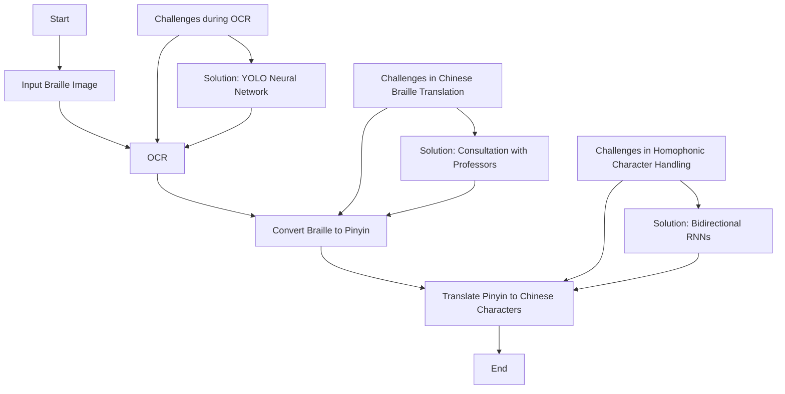

Vision Braille Project: Bridging Education for Blind Children

# Introduction

In China, approximately 240,000 children between the ages of 0 and 17 face visual disabilities. Unfortunately, their educational opportunities remain limited to a handful of specialized schools. These schools often struggle to find qualified braille teachers, making education for blind students a challenging endeavor.

Recognizing this gap, I embarked on the Vision Braille Project. The project aims to empower blind children by providing an innovative solution: a braille translation website. This platform facilitates communication between traditional schoolteachers and visually impaired students.

How It Works:

- Input Braille Text: Teachers upload written homework or assignments in braille to the website.
- Instant Translation: The website swiftly translates the braille content into standard text (pinyin or Chinese characters).
- Accessible Learning: Teachers can now understand and evaluate the work of blind students, fostering inclusive education.
By bridging this gap, the Vision Braille Project ensures that blind children can learn alongside their sighted peers, unlocking a brighter future for all. 🌟

The tesing app is available at [Vision Braille Project](http://154.12.37.165:5000/)

# Flowcharts
